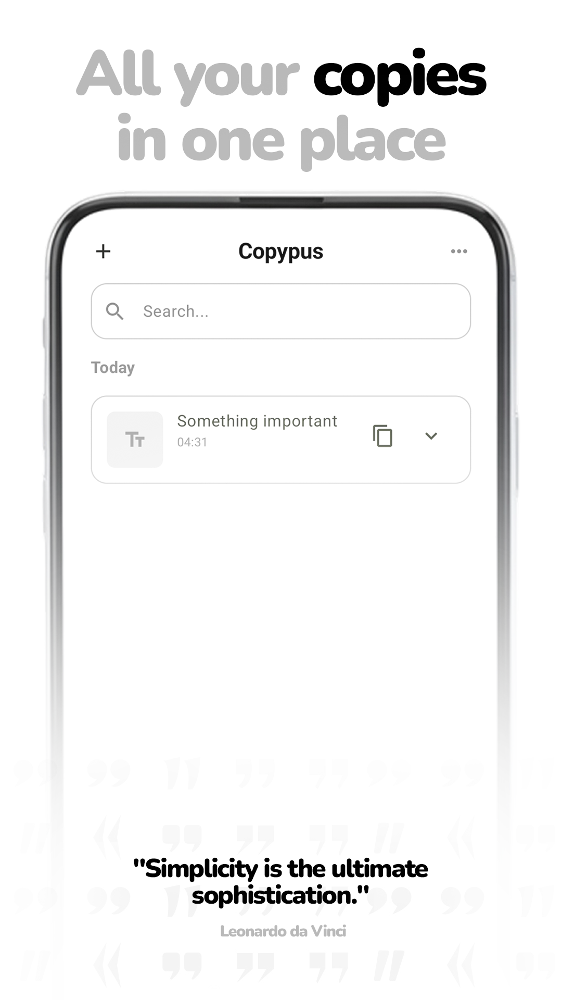
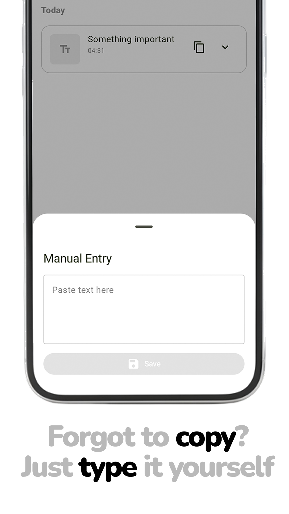
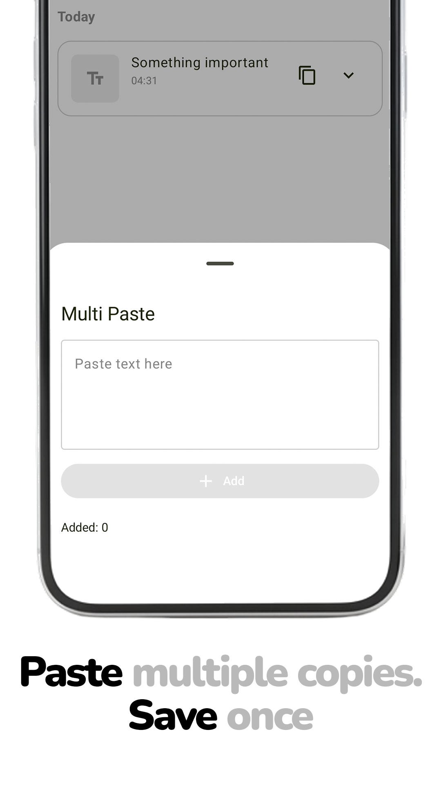
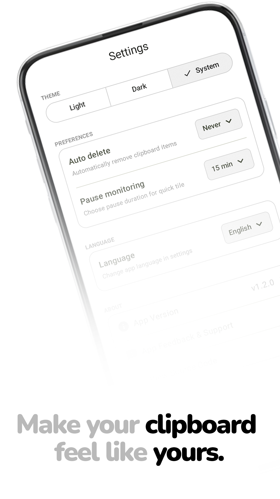
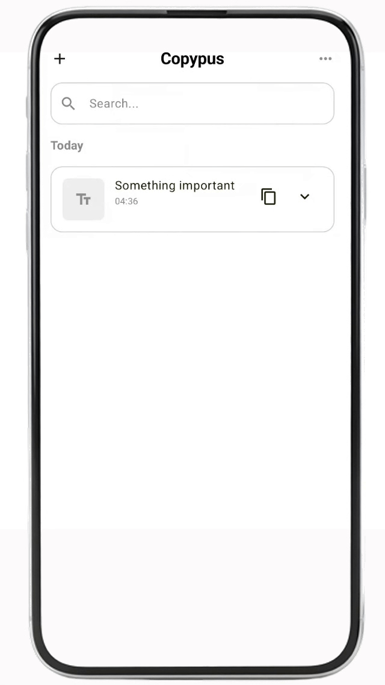
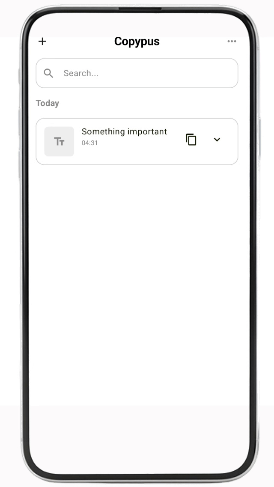

  

<h1 align="center">
  Copypus
</h1>

 

<b>Copypus automatically saves everything you copy – links, text snippets, code</b>

    
    
    
    
    
    

  <h1>
    Download
  </h1>
  

<b>SHA-256 hash of the signing certificate are provided</b> on the <a href="https://github.com/EmilioAugust/Copypus/releases">GitHub releases page</a>

<h2 align="center">
✨<b>Features</b>
</h2>

- **Automatic Clipboard Saving** 
  - Anything copied in other apps is automatically detected and saved when you open the app.

- **Favorites Support**
  - Swipe right to add items to favorites and access them anytime in a dedicated Favorites tab.

- **Quick Delete Gestures**
  - Swipe left to instantly remove unnecessary clipboard items.

- **One-Tap Copying**
  - Easily copy saved content back to your clipboard with a dedicated copy button.

- **Smart Date Grouping**
  - Clipboard history is automatically organized by time sections like **Today**, **Yesterday**, and older dates.

- **Fast Search**
  - Quickly find copied text using the built-in search feature.

- **Clear All History**
  - Remove your entire clipboard history with a single tap.

- **Customizable App Theme**
  - Choose the app theme that fits your style in Settings.

- **Auto-Delete Options**
  - Automatically remove old clipboard items after:
    * 1 hour
    * 5 hours
    * 1 day
    * 1 week
    * 1 month
    * or never

- **Bottom Navigation**
  - Simple bottom navigation for quick access to:

    * Clipboard History
    * Favorites
    * Settings
      
- **Languages**
  - Russian and Spanish translations.
    
- **Copy selectively**
  - You can copy specific selections instead of the entire text.
    
- **Pause Monitoring**
  - Ability to pause monitoring directly from the Quick Tile.
    
- **Quick Tile Enhancement**
  - "Copy Last Text" option to the Quick Tile for faster access.
- **Edit items**
  - Simply long-press (long click) on any item's icon (note, code snippet, or link) to open the edit screen. 

<h2 align="center">
📄 License
</h2>
This project is licensed under the MIT License — see the <a href="https://github.com/EmilioAugust/Copypus/blob/main/LICENSE">LICENSE</a> file for details
